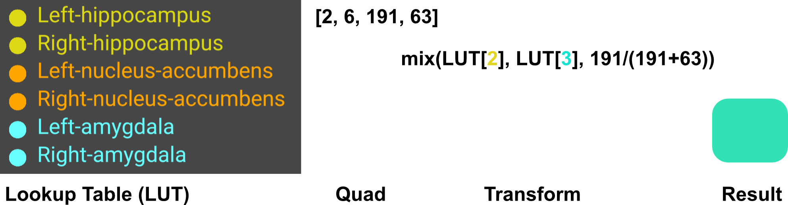

## About

Najdenovska et al. ([2018](https://pubmed.ncbi.nlm.nih.gov/30480664/))  provide a spatial probabilistic atlas map (SPAM) of 14 thalamic nuclei (Thalamus_Nuclei-HCP-4DSPAMs). The atlas was aligned to an unspecified nonlinear version of the ICBM152 template; here, we assume the [2009b variant](https://www.bic.mni.mcgill.ca/ServicesAtlases/ICBM152NLin2009) variant. These files have been optimized for use with NiiVue and retain the original CC BY-SA 4.0 license. A compatible NiiVue [colormap](https://niivue.com/docs/colormaps2#atlases-and-labeled-images) is also included. Images have been losslessly cropped to reduce file size.

Unlike discrete atlases, where each voxel has a single label, probabilistic atlases preserve information about partial volume effects and individual variability—particularly valuable at region boundaries. However, traditional formats are not well suited for interactive visualization. For instance, Najdenovska’s atlas stores a 197×233×189×14 float32 volume, consuming over 485 MB.

To support efficient visualization, we provide a script that converts any SPAM atlas into PAQD format. Probabilistic Atlas Quad Datatype (PAQD, pronounced "packed" to evoke compactness) encodes the top two most probable atlas regions and their associated probabilities into a single 3D RGBA image. This compact representation eliminates the need for multi-volume storage typical of conventional probabilistic atlases, which require one float volume per region. Instead, PAQD uses a single 8-bit-per-channel RGBA texture where:

 - R: (Red) stores the index of the most likely region
 - G: (Green) stores the index of the second most likely region
 - B: (Blue) stores the probability of the most likely region
 - A: (Alpha) stores the probability of the second most likely region

This design reduces file size, simplifies distribution, and enables GPU-accelerated rendering and interactive querying with minimal memory overhead, while still preserving key probabilistic information.

This example uses UINT8 precision for compatibility and compactness, but the method can be adapted to use higher precision (e.g., [RGBA32F](https://webgl2fundamentals.org/webgl/lessons/webgl-data-textures.html)) for atlases with more regions or finer probabilistic detail. Currently, NiiVue is the only tool able to interpret these images, but we hope the inherent advantages of this format will lead to broader adoption.

The figure below provides a concrete example of PAQD encoding. The color lookup table (LUT) assigns yellow to the left and right hippocampus (indices 1 and 2), orange to the left and right nucleus accumbens (3 and 4), and cyan to the left and right amygdala (5 and 6). Consider a voxel quad with four color components: [2, 6, 191, 63]. This indicates that the voxel is composed of 75% right hippocampus (index 2, weight 191/255) and 25% right amygdala (index 6, weight 63/255). The resulting blended color is a mint green—derived from 75% yellow and 25% cyan.



## Creating new Atlases

The provided Python script can convert a probabilistic atlas to PAQD. For example, if for the [Thalamus_Nuclei-HCP-4DSPAMs](https://zenodo.org/records/1405484) you can run:

```bash
python spam2paqd.py Thalamus_Nuclei-HCP-4DSPAMs.nii.gz 
python crop_paqd_to_rgba32.py Thalamus_Nuclei-HCP-4DSPAMs_paqd.nii.gz
```

## Links

 - [Original images and license](https://zenodo.org/records/1405484).

## Citations

 - Najdenovska E, Alemán-Gómez Y, Battistella G, Descoteaux M, Hagmann P, Jacquemont S, Maeder P, Thiran JP, Fornari E, Bach Cuadra M ([2018](https://pubmed.ncbi.nlm.nih.gov/30480664/)) In-vivo probabilistic atlas of human thalamic nuclei based on diffusion- weighted magnetic resonance imaging. Sci Data 27:5:180270. doi: 10.1038/sdata.2018.270.
